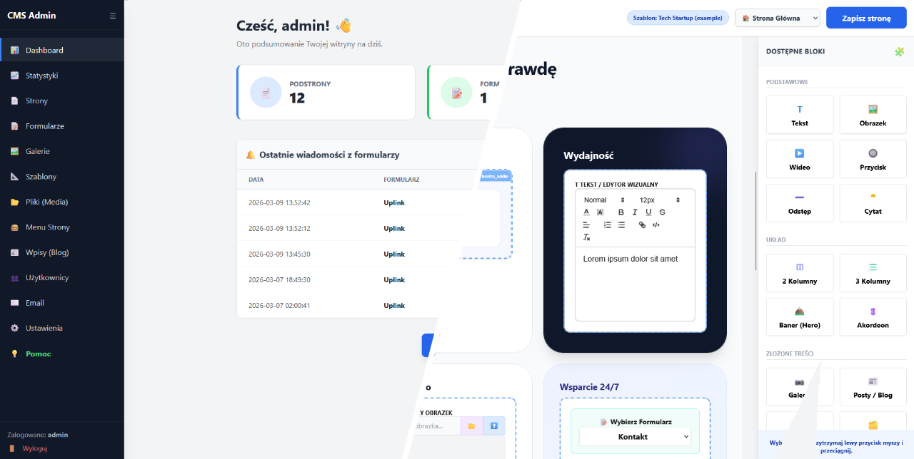

[](https://github.com/krzysztofchojka/page-admin/actions/workflows/ci.yml)

# page-admin 2.0

Lekki, autorski system CMS oparty na architekturze **MVC**.  
Posiada wbudowany **Page Builder (Drag & Drop)**, szyfrowany system formularzy oraz własny system mailowy.

Filozofią tego projektu jest **Drop & Run** – instalacja na serwerze produkcyjnym **nie wymaga terminala, Node.js ani skomplikowanej konfiguracji**.  
Wgrywasz pliki przez FTP i strona działa.

[](screenshot.png)

## Instalacja na serwerze (Produkcja)

Aby uruchomić system na dowolnym hostingu (Apache, LiteSpeed, Nginx):

### 1. Pobierz odpowiednią paczkę
Przejdź do zakładki **Releases** na GitHubie i pobierz paczkę ZIP dopasowaną do Twojego serwera:
- **`cms-standard-build.zip`** – Wybierz tę paczkę, jeśli masz nowoczesny hosting (np. VPS, dedyk, panel DirectAdmin/cPanel), na którym możesz ustawić folder `/public` jako główny katalog domeny (tzw. DocumentRoot).
- **`cms-shared-hosting-build.zip`** – Wybierz tę paczkę dla hostingów współdzielonych, które wymuszają wrzucanie plików do nadrzędnego folderu `public_html` lub `htdocs`. Posiada ona specjalnie skonfigurowany plik `.htaccess`, który przekieruje ruch do odpowiedniego katalogu.

### 2. Wgraj pliki i utwórz bazę danych
Wypakuj pobrane pliki i wrzuć je na swój serwer przez FTP. Następnie w panelu swojego hostingu utwórz pustą bazę **MySQL / MariaDB** i przygotuj jej dane logowania.
*Zalecane kodowanie bazy to uniwersalne `utf8mb4` (np. z systemem porównywania `utf8mb4_unicode_ci`), co zapewni pełną obsługę wszystkich znaków specjalnych i emoji.*

### 3. Uruchom kreator w przeglądarce
Wejdź na swój adres URL:

twojadomena.pl/install

Wpisz dane do bazy. Skrypt sam wygeneruje klucze bezpieczeństwa (plik `.env`) i zbuduje strukturę tabel.

### 4. Zaloguj się
Po udanej instalacji system przeniesie Cię do logowania:

Login: admin
Hasło: admin


## Przewodnik dla programistów (Środowisko Dev)

Projekt wykorzystuje **system komponentów** do budowy bloków oraz **Tailwind CSS**.

Pliki CSS są generowane przy pomocy **Node.js**, ale **Node nigdy nie trafia na serwer klienta**.

### Wymagania systemowe
- PHP **8.1+** (wymagane rozszerzenia: `pdo_mysql`, `mbstring`, `zip`, `gd`)
- MySQL 8.0+ / MariaDB
- Node.js (tylko do kompilacji CSS w środowisku dev)

---

## Inicjalizacja projektu

Otwórz terminal w folderze projektu i zainstaluj zależności frontendowe (tylko raz):

```bash
npm install
```

---

## 2. Development

Podczas pracy nad projektem uruchom **dwa procesy w terminalu**.

---

## Terminal 1 — Kompilator CSS (Tailwind)

Uruchom watcher, który będzie śledził zmiany w plikach:

```bash
npm run dev
```

---

## Terminal 2 — Serwer PHP

Uruchom wbudowany serwer PHP:

```bash
php -S localhost:8000 -t public
```

Następnie otwórz w przeglądarce:

```
http://localhost:8000
```

---

# Wysyłka na produkcję (Kluczowy proces)

Zanim wykonasz **git push** lub wgrasz pliki na serwer klienta, musisz skompilować zoptymalizowany CSS:

```bash
npm run build
```

Komenda:

- kompresuje styl
- generuje plik:

```
public/assets/css/style.css
```

Plik ma zazwyczaj **kilka kilobajtów**.

Na serwer produkcyjny wysyłasz tylko:

- kod **PHP**
- wygenerowany plik **style.css**

Folder:

```
node_modules
```

**zostaje tylko na Twoim komputerze**.

---

## Architektura klocków (Page Builder)

Wszystkie moduły strony (**klocki**) znajdują się w folderze:

```
src/Blocks/
```

Każdy blok implementuje:

```
BlockInterface
```

## Dodawanie nowego klocka

## 1. Stwórz plik

```
src/Blocks/MyNewBlock.php
```

## 2. Zaimplementuj metodę

```
render()
```

## 3. Zarejestruj blok

Dodaj go do tablicy w pliku:

```
src/Helpers/BlockRenderer.php
```
